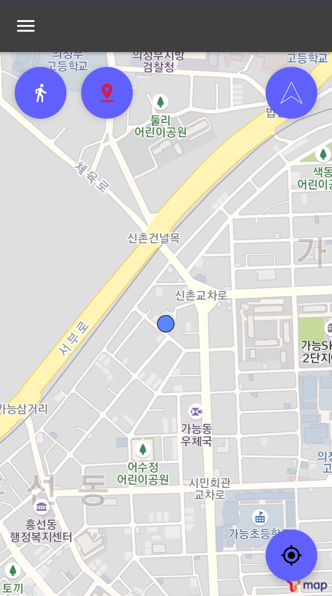
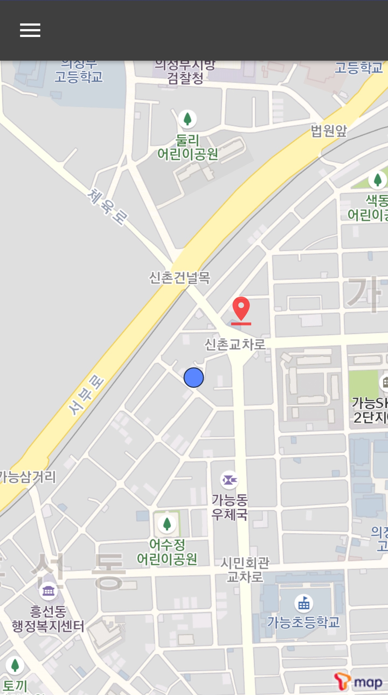
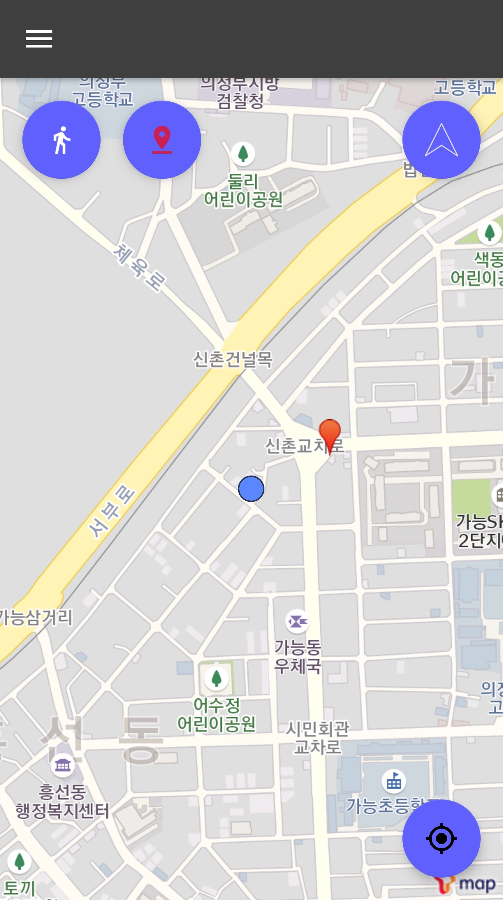
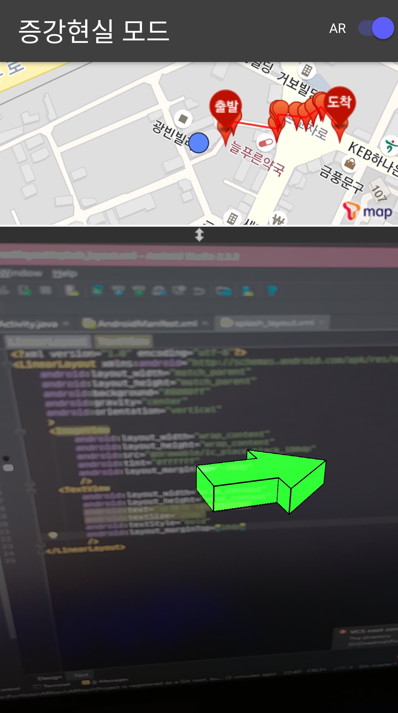
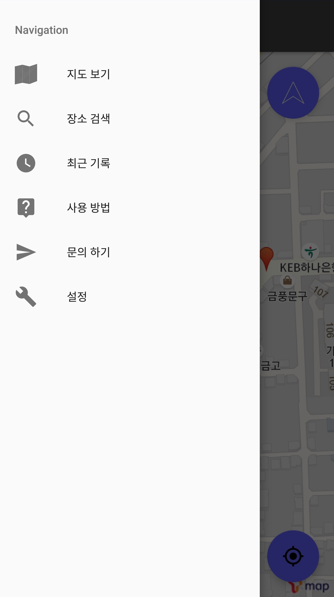
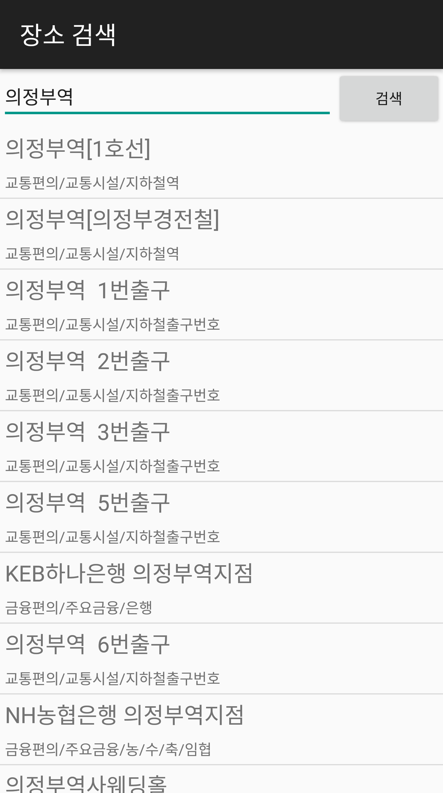
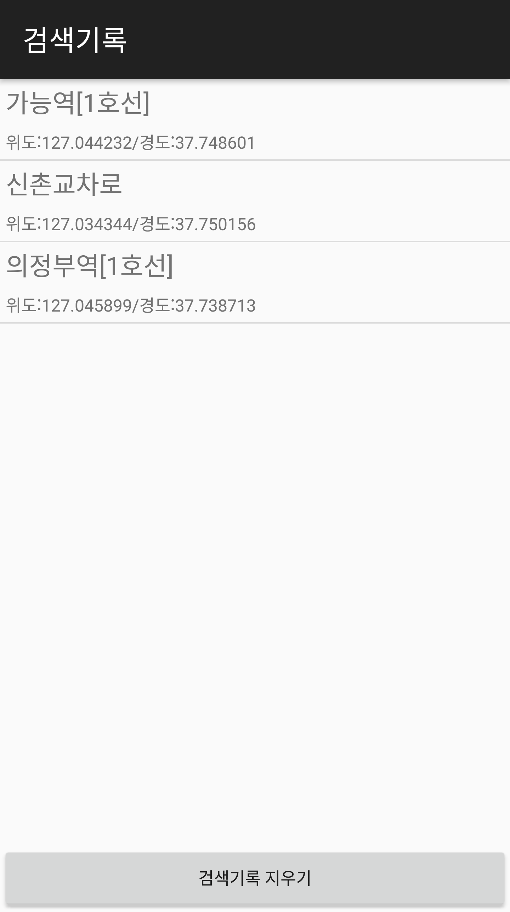
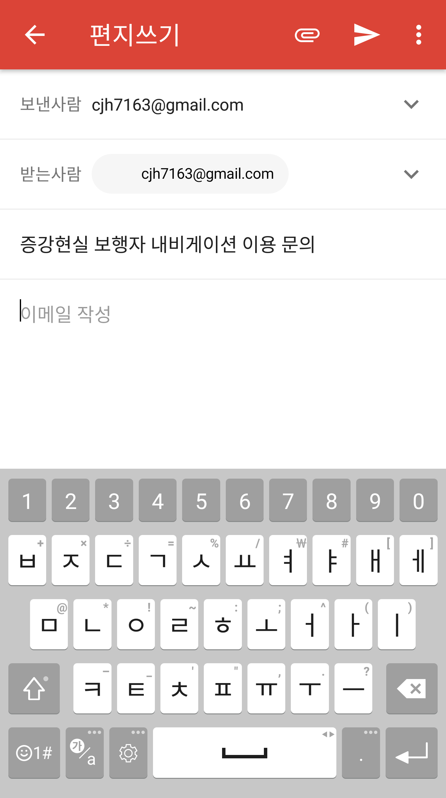
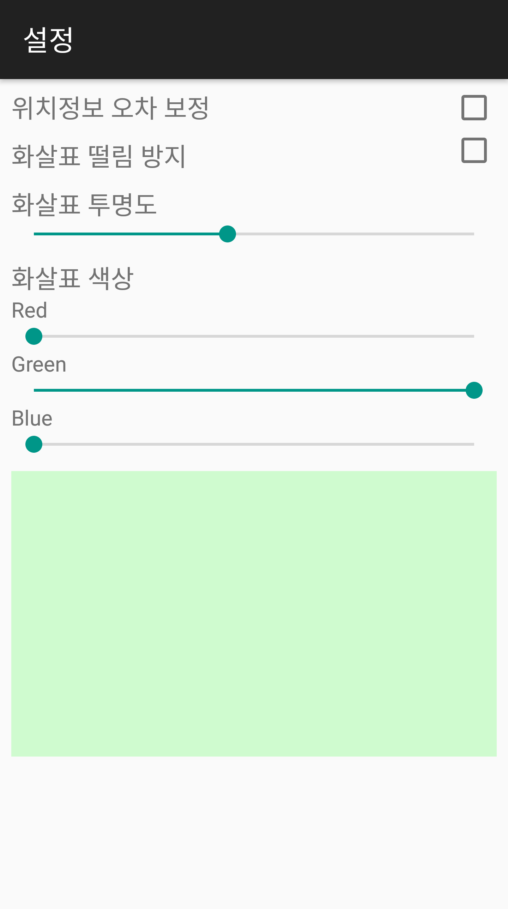

# 증강현실 보행자 내비게이션

### 사용 기술 및 알고리즘  
  
* T Map API
* GPS 센서
* OpenGL  
* 더 정확한 위치 정보 얻기 (Google - isBertterLocation(), [링크](https://developer.android.com/guide/topics/location/strategies.html#BestEstimate))

### 언어 및 플랫폼  
  
* Android 4.4+
* Java

### 기능 명세서  
* [pdf](docs/기능명세.pdf)  
* [docx](docs/기능명세.docx)  
    
### 스크린샷  
  
  
*[그림1] 스플래시 화면*  

  
*[그림2] 지도 화면*  
스플래시 화면에서 자동으로 넘어오는 화면  
앱 구동 중에 자동으로 내 위치 정보를 받아와서 지도 위에 표시하여 주며, 원할 경우 우측 하단의 버튼을 터치하면 즉시 내 위치 정보를 표시한다.  

  
*[그림3] 도착지를 설정 중인 화면*  
좌측 상단의 핀 버튼을 터치하여 드래그하면 위 그림과 같이 핀 아이콘이 생성되어 원하는 지점에서 터치를 완료하면 도착지로 설정할 수 있다.

  
*[그림4] 도착지가 설정된 화면*  
도착지로 설정한 위치에 핀 아이콘이 생성된 것을 확인할 수 있다.

  
*[그림5] 길 안내 중인 화면*  
도착지 설정 후 좌측 상단의 걷기 버튼을 터치하여 실시간 길 안내 서비스를 이용할 수 있다. 우측 상단의 화살표는 도착지에 도달하기 위한 방향을 나타내며 실시간으로 회전한다.

  
*[그림6] 길 안내 중인 화면(3D)*  
액션 바 우측에 있는 AR 스위치를 킬 경우 나타나는 화면이다.  
상단에는 기존의 지도가 그대로 나타나며, 하단에는 현재 스마트폰 카메라를 통해 들어오는 영상과 방향을 안내하는 3D 화살표가 생성된다.
그리고 두 영역 사이에는 각 영역의 크기를 조절할 수 있는 디바이더가 존재한다.

  
*[그림7] 메뉴 화면*  
액션 바 좌측의 햄버거 메뉴 버튼을 누를 경우 나타나는 메뉴 화면이다.  
지도 보기, 장소 검색, 최근 기록, 문의하기, 설정 메뉴가 존재한다.

  
*[그림8] 검색 화면*  
검색 메뉴 선택 시 나타나는 검색 화면이다.  
키워드를 통해 POI(관심 지점)를 검색할 수 있다.

  
*[그림9] 최근 기록 화면*  
최근에 검색했던 기록들을 확인할 수 있다.  
아래의 [검색기록 지우기] 버튼을 누르면 검색 기록이 모두 지워진다.

  
*[그림10] 문의 하기 화면*  
외부 이메일 앱을 통해 제작자에게 문의 메일을 전송할 수 있다.

  
*[그림11] 설정 화면*  
설정 화면에서는 내비게이션 서비스에 관한 각종 옵션들을 제공한다.